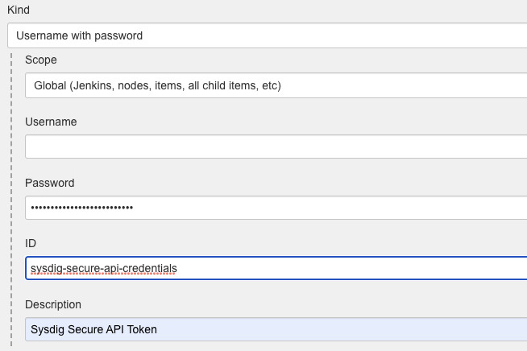
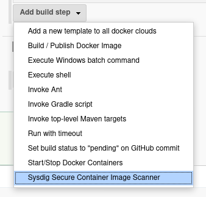
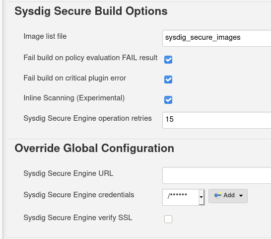

# Sysdig Secure Jenkins Plugin


[Sysdig Secure](https://sysdig.com/products/secure/) is a container
security platform that brings together docker image scanning and
run-time protection to identify vulnerabilities, block threats, enforce
compliance, and audit activity across your microservices. The Sysdig
Secure Jenkins plugin can be used in a Pipeline job, or added as a build
step to a Freestyle job, to automate the process of running an image
analysis, evaluating custom policies against images, and performing
security scans.

Table of Contents
=================

* [Table of Contents](#table-of-contents)
* [Getting Started](#getting-started)
  * [Pre\-requisites](#pre-requisites)
  * [Installation](#installation)
  * [Configuration](#configuration)
* [Integrate the Sysdig Secure Plugin with a Freestyle Project](#integrate-the-sysdig-secure-plugin-with-a-freestyle-project)
* [Local development and installation](#local-development-and-installation)

# Getting Started

## Backend scanning or Inline scanning

The Sysdig Secure plugin supports two different operation modes:
* **Backend Scanning**: Image scanning happens in the Sysdig Secure Backend
* **Inline Scanning**: Image scanning happens in the Jenkins worker nodes

### Backend Scanning

PRO:
* Jenkins workers do not need to communicate with the host-local Docker daemon

CON:
* Sysdig Secure Backend needs to have network visibility in order to fetch and scan the images during the pipeline

### Inline Scanning

PRO:
* No need to configure registry credentials in the Sysdig Secure Backend
* No need to expose your registry externally, so it can be reached by Sysdig Secure (see CON in the section above)
* Image contents are never transmitted outside the pipeline, just the image metadata

CON:
* The job performing the inline scanning needs to have access to the host-local Docker daemon

## Pre-requisites

Both modes require a valid [Sysdig Secure API token](https://docs.sysdig.com/en/find-the-super-admin-credentials-and-api-token.html#al_UUID-be84a2f1-b996-c30c-b5d8-5b8e4663146a_UUID-87bc65c6-ef79-6225-3910-39f619617a2c)

For Backend mode, the Sysdig Backend (SaaS or Onprem) needs to be able to fetch the images produced by this pipeline, usually accessing a buffer Docker repository.

For Inline mode, Jenkins workers need to have access to the host-local Docker daemon, in the most common case, by mounting or linking the Docker socket. The Jenkins worker user needs to be able to read and write the socket.

## Installation

The Sysdig Secure plugin is published in the Jenkins plugin registry,
and is available for installation on any Jenkins server.

1.  <https://github.com/jenkinsci/sysdig-secure-plugin>

## Configuration

To configure the Sysdig Secure plugin:

1.  Complete these steps after installing the hpi file from the installation link above.
2.  From the main Jenkins menu, select `Manage Jenkins`.
3.  Click the `Configure System` link.  
    
4.  Scroll to the `Sysdig Secure Plugin Mode` section.
5.  Create a new credential containing the Sysdig API key found here (You just need to fill the password field): <https://secure.sysdig.com/#/settings/user>

    
    
6.  Configure the Sysdig Backend URL, `https://secure.sysdig.com` if you are using SaaS or your own if you are using an on-prem installation, and select the previously created credential.

    Mark the Inline scanning option in case you have decided to use Inline scanning:

    
    
7.  Click `Save`.

# Integrate the Sysdig Secure Plugin with a Freestyle Project

The Sysdig Secure plugin reads a file called `sysdig_secure_images` for
the list of images to scan. In the example below, an execute shell build
step is used to build and push a container to a local registry:

```
TAG=$(date "+%H%M%S%d%m%Y")
IMAGENAME=build.example.com/myapp
docker build -t $IMAGENAME:$TAG .
docker push $IMAGENAME:$TAG
```

This process is an example, and should be used as a guide, rather than
copying commands directly into a terminal.

To configure the build step, add a line to the script to create the
`sysdig_secure_images` file:

```
TAG=$(date "+%H%M%S%d%m%Y")
IMAGENAME=build.example.com/myapp
docker build -t $IMAGENAME:$TAG .
docker push $IMAGENAME:$TAG

# Line added to create sysdig_secure_images file
echo "$IMAGENAME:$TAG ${WORKSPACE}/Dockerfile " > sysdig_secure_images
```

Multiple lines can be added if the build produces more than a single
container image.

Once the image has been built and pushed to the staging registry, the
Sysdig Secure Image Scan can be called from the Jenkins UI:

1.  Open the `Add build step` drop-down menu, and select
    `Sysdig Secure Container Image Scanner`. This creates a new build
    step labeled `Sysdig Secure Build Options`.  
    
2.  Configure the available options, and click `Save`.  
      
    The table below describes each of the configuration options.

    | Option                                 | Description                                                                                                                                                                                                                                                      |
    |----------------------------------------|------------------------------------------------------------------------------------------------------------------------------------------------------------------------------------------------------------------------------------------------------------------|
    | Image list file                        | The name of the file, present in the workspace that contains the image name, and optionally the Dockerfile location.                                                                                                                                             |
    | Fail build on policy check STOP result | If the Sysdig Secure policy evaluate returns a fail (STOP) then the Jenkins job should be failed. If this is not selected then a failed policy evaluation will allow the build to continue.                                                                      |
    | Fail build on critical plugin error    | If selected, and the Sysdig Secure Plugin experiences a critical error, the the build will be failed. This is typically used to ensure that a fault with Sysdig Secure (eg. service not available) does not permit a failing image to be promoted to production. |
    | Inline Scanning                        | **Experimental feature.** Executes the scanning in the same host where the image has been built without needing to push it to an staging registry. Requires a runner with access to the Docker socket at `/var/run/docker.sock` and read-write privileges in it. |
    | Sysdig Secure operation retries        | The number of retries that the plugin will execute in case of an error while scanning the image.                                                                                                                                                                 |

# Local development and installation

Use docker to build the sysdig-secure.hpi file:

```sh
docker run -it --rm --name maven-jenkins-builder -v "$(pwd)":/usr/src/app -w /usr/src/app maven:3.3-jdk-8 mvn package
```

You can then install the plugin via the Jenkins UI, or by copying it into $JENKINS_HOME/plugins.
